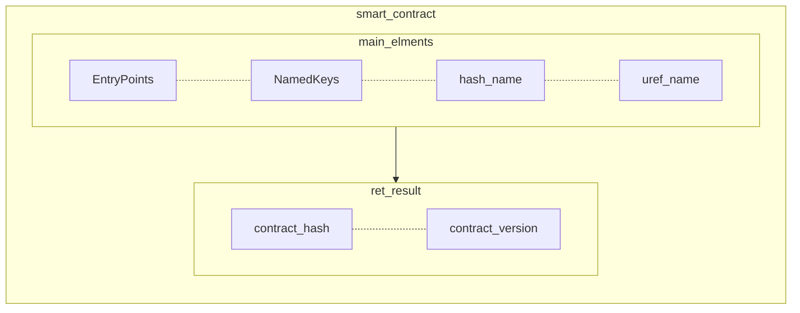

# rust

```
Important syntax elements used frequently in Rust:

Match
Array
Loop
Vectors
Functions

To be able to comfortably write code in Rust it is crucial to understand these topics before going further into the examples.
```

---

```
# rustup --version
```
rustup is the rust installer and version manager.


```
# rustc first.rs
```
rustc is the rust compiler.


## cargo

cargo is the rust build tool and package manager. how to manage your projuect with cargo? `cargo` can help organize the project and build the project. `cargo` can also help download and install the dependencies of the project. `cargo` can also help publish the project to the rust package repository.
```
cargo --version
```
check the version of cargo.


```
cargo new [directory]

cargo new --vcs=git [directory]
```
create a new project and generate some files by default into the project. `VCS` is `v`ersion `c`ontrol `s`ystem.  The default VCS is git. If other VCS is needed, use `--vcs` to specify it. `cargo new [directory]` command will generate a `Cargo.toml` file and a `src` directory. The `Cargo.toml` file is the configuration file for the project. The `src` directory contains the source code of the project.

```
cargo build
cargo build --release

cargo run
cargo run --release

cargo check
```
- We can build a project using `cargo build`. `cargo build release` will build the project in release mode. The difference between release mode and debug mode is that the release mode will optimize the code and make it run faster. The release mode will also generate a smaller binary file, and the binary file will be stored in the `target/release` directory instead of the `target/debug` directory.
- We can build and run a project in one step using `cargo run`.
- We can build a project without producing a binary to check for errors using `cargo check`.
- Instead of saving the result of the build in the same directory as our code, Cargo stores it in the target/debug directory.

```
cargo update
```
`cargo update` will update the dependencies of the project. executing `cargo update` command would ignore the current content of the `Cargo.lock` file and figure out all the latest versions of the dependencies that fit the requirements in the `Cargo.toml` file. Then it will update the `Cargo.lock` file with the latest versions of the dependencies. 

---

```
cargo doc --open
```
`cargo doc --open` will generate the documentation of the project and open it in the browser. The documentation is generated in the `target/doc` directory. The documentation is generated from the comments in the source code. The comments are written in the markdown format.

#
`Cargo.lock` file is important for figuring out the dependancy of versions of the third libraries that the project relies on. 

managing dependencies with cargo and keeping track of the versions of the dependencies automatically. 

#
`rustup target add wasm32-unknown-unknown` means that the target wasm32-unknown-unknown is added to the `rust toolchain`. The target wasm32-unknown-unknown is used to compile Rust code to WebAssembly, which can be run in web browsers or other environments that support WebAssembly.

`rustup` command is used to manage the `rust toolchain`. The operation on installing and switching can be done easily.

`rust toolchain` refers to a collection of programs and tools to develop and Compile Rust application. The `rust toolchain` includes the Rust compiler (rustc), the dependency manager and build tool (cargo), and the documentation generator (rustdoc), and the standard library for the default platform.


#
The command `rustup target add wasm32-unknown-unknown` is used to add the WebAssembly (wasm32) target to the `Rust toolchain`. This allows you to compile Rust code to WebAssembly, which can be run in web browsers or other environments that support WebAssembly.

The `Rust toolchain` is a collection of programs needed to compile a Rust application. It includes the Rust compiler (rustc), the dependency manager and build tool (cargo), and the documentation generator (rustdoc).


# 
`Cargo.toml` file.

    [package]
    name = "contract"
    version = "0.1.0"
    authors = ["CasperLabs <https://discord.com/invite/Q38s3Vh>"]
    edition = "2021"

    # See more keys and their definitions at https://doc.rust-lang.org/cargo/reference/manifest.html

    [dependencies]
    casper-contract = "1.4.4"
    casper-types = "1.5.0"

    [[bin]]
    name = "contract"
    path = "src/main.rs"
    bench = false
    doctest = false
    test = false

[[bin]] is used to tell Cargo that the project is a binary project. [[bin]] module can be used multiple times to specify multiple binaries in a project. The `name` key is used to specify the name of the binary. The `path` key is used to specify the path of the source code file of the binary. The `bench`, `doctest`, and `test` keys are used to specify whether the binary is a benchmark, doctest, or test. The default value of these keys is false, and the last three keys can be omitted if the binary is not a benchmark, doctest, or test.


## key words

- `pub` is used to specify that the function is public. The public function can be called from outside the contract.
- `pub use` is used to specify that the function is public. The public function can be called from outside the contract.

        mod front_of_house {
            pub mod hosting {
                pub fn add_to_waitlist() {}
            }
        }

        pub use crate::front_of_house::hosting;

        pub fn eat_at_restaurant() {
            hosting::add_to_waitlist();
        }
    Before this change, external code would have to call the add_to_waitlist function by using the path `restaurant::front_of_house::hosting::add_to_waitlist()`. Now that this pub use has **re-exported** the hosting module from the root module, external code can now use the path `restaurant::hosting::add_to_waitlist()` instead.

- `as` is used to (1), specify the alias of the function. The alias can be used to call the function.

    ```rust
        use std::fmt::Result;
        use std::io::Result as IoResult;

        fn function1() -> Result {
            // --snip--
        }

        fn function2() -> IoResult<()> {
            // --snip--
        }
    ```
    When you see a function that returns a value of type io::Result<()>, it means that the function performs some kind of input/output operation and can either succeed without returning a value, or fail and return an error of type std::io::Error.

    (2) disambiguate the specific trait containing an item.

    ```rust
        trait Foo {
            fn bar(&self);
        }

        trait Baz {
            fn bar(&self);
        }

        struct Quux;

        impl Foo for Quux {
            fn bar(&self) {
                println!("Foo::bar");
            }
        }

        impl Baz for Quux {
            fn bar(&self) {
                println!("Baz::bar");
            }
        }

        fn main() {
            let q = Quux;
            <Quux as Foo>::bar(&q); // as used to cast Quux to Foo
            <Quux as Baz>::bar(&q); // as used to cast Quux to Baz
        }

    ```

- `impl` is used to implement inherent or trait functionality(source: https://doc.rust-lang.org/book/appendix-01-keywords.html). What is the difference between inherent and trait functionality? Inherent functionality is the functionality that is inherent to the type. Trait functionality is the functionality that is defined in the trait. The inherent functionality is implemented using the `impl` keyword. The trait functionality is implemented using the `impl` keyword and the `trait` keyword.

  - example of implementing inherent functionality:
    ```rust
    struct Rectangle {
        width: u32,
        height: u32,
    }

    impl Rectangle {
        fn area(&self) -> u32 {
            self.width * self.height
        }
    }

    fn main() {
        let rect1 = Rectangle { width: 30, height: 50 };

        println!(
            "The area of the rectangle is {} square pixels.",
            rect1.area()
        );
    }
    ```
  - example of implementing trait functionality
    ```rust
        trait HasArea {
            fn area(&self) -> f64;
        }

        struct Circle {
            x: f64,
            y: f64,
            radius: f64,
        }

        impl HasArea for Circle {
            fn area(&self) -> f64 {
                std::f64::consts::PI * (self.radius * self.radius)
            }
        }

        fn main() {
            let c = Circle { x: 0.0, y: 0.0, radius: 2.0 };
            println!("{}", c.area());
        }
    ```

- `self` is similar to `this` in other language. `self` is used to refer to the current object. `self` is used in the implementation of inherent functionality and trait functionality.
- `Self` refers to that a type alias for the type we are defining or implementing.

- `trait` is used to define a trait, and is similar to interface in other language. `trait` separates types and behaviours of an object, to enable programmers to write common and generic code.

- `return` is used to return a value from a function. The return value of a function is the last expression in the function. The keyword `return` can be removed explicitly.
```rust
    fn five() -> i32 {
        5
    }
```

- `for` (1), loop over items from an iterator, (2), implement a trait, or (3), specify a higher-ranked lifetime.

    - used for loop over items from an iterator:
    ```rust
        let v1 = vec![1, 2, 3];

        let v1_iter = v1.iter();

        for val in v1_iter {
            println!("Got: {}", val);
        }
    ```
    - used for implement a trait:
    ```rust
        trait Iterator {
            type Item;

            fn next(&mut self) -> Option<Self::Item>;

            // methods with default implementations elided
        }

        struct Counter {
            count: u32,
        }

        impl Iterator for Counter {
            type Item = u32;

            fn next(&mut self) -> Option<Self::Item> {
                self.count += 1;

                if self.count < 6 {
                    Some(self.count)
                } else {
                    None
                }
            }
        }
    ```
    - used for specify a higher-ranked lifetime:
    ```rust
        fn longest<'a>(x: &'a str, y: &'a str) -> &'a str {
            if x.len() > y.len() {
                x
            } else {
                y
            }
        }

        trait Foo<T> {
            fn foo(&self, x: T);
        }

        impl<T> Foo<T> for Vec<T>
        where
            for<'a> &'a T: std::fmt::Display,
        {
            fn foo(&self, x: T) {
                println!("{}", x);
            }
        }

    ```


- `break` exits the loop. `break` can be used in the loop and `match` expression.

- `where` clause

    ```rust
    impl <A: TraitB + TraitC, D: TraitE + TraitF> MyTrait<A, D> for YourType {}

    // using where clause to change this sentence
    impl <A, D> MyTrait<A, D> for YourType where
        A: TraitB + TraitC,
        D: TraitE + TraitF
    {}

    these two expressions are equivalent. But the second one is more clear.
    ```
    - why the `where clause` is introduce in Rust
      - the bounds on anything can not be fully expressed other that type parameters.
      - it does not work well with associated types. Because the value of associated types can not be specified with no space.
      - it's just plain hard to read.

- `crate`, in a module path, refers to the crate root

- `async`, returns a Future instead of blocking the current thread
- `await`, suspends execution until the result of a Future is ready

    ```rust
    async fn async_function() -> u32 {
        42
    }

    #[tokio::main]
    async fn main() {
        let result = async_function().await;
        println!("{}", result);
    }
    ```

    ```rust
    // `block_on` blocks the current thread until the provided future has run to
    // completion. Other executors provide more complex behavior, like scheduling
    // multiple futures onto the same thread.
    use futures::executor::block_on;

    async fn hello_world() {
        println!("hello, world!");
    }

    fn main() {
        let future = hello_world(); // Nothing is printed
        block_on(future); // `future` is run and "hello, world!" is printed
    }
    ```
    Unlike `block_on`, `.await` doesn't block the current thread, but instead asynchronously waits for the future to complete, allowing other tasks to run if the future is currently unable to make progress.

    some drawbacks of using async in Rust
    1. a state machine generated by the compiler of Rust for echa `async` function is used to manage the execution of the function.
    2. state machines are included in the compiled binary, which increases the size of the binary.
    3. using `async` in Rust requires a `async` runtime in corresponding executable file. The runtime is responsible for managing the execution of `async` functions, while it can contribute to an increase in the size of the binary.

- `mod` is used to specify that the function is a module. The module can be used to organize the code. The module can be nested.


#

4 steps

1. casper-client keygen ed25519-keys

2. casper-client keygen -a secp256k1 secp256k1-keys

3. casper-client account-address --public-key 010df5aadf97e64421d81130275154fb32e3e81ccc73b08d50f143d78bfff2d7ee

4. casper-client get-state-root-hash --node-address http://135.181.114.117:40068
    
    return error executing this commands, error msg is blow:
    response for rpc-id -3258620763858802899 chain_get_state_root_hash is http error: HTTP status server error (500 Internal Server Error) for url (http://52.34.201.174:6666/rpc)

    casper-client get-state-root-hash --node-address http://65.108.0.148:7777


#
#[no_mangle] is used to tell the compiler not to mangle the name of the function. This is required because the function will be called from outside the contract, and the name of the function must be preserved.

#[no_std] is used to tell the compiler not to link the standard library. This is required because the standard library is not available in the Wasm environment.

#[no_main] is used to tell the compiler not to generate the main function. This is required because the contract will be called from outside the contract, and the main function is not needed.

#![allow(unused)] is used to tell the compiler not to generate warnings for unused code. This is required because the contract will be called from outside the contract, and the main function is not needed.

`#[cfg(not(target_arch = "wasm32"))]`

    #[cfg()] is a conditional compilation attribute. The code inside the brackets following cfg is included at compile time based on the specified conditions.

#
some problems encountered

```
error: package `rustix v0.38.6` cannot be built because it requires rustc 1.63 or newer, while the currently active rustc version is 1.61.0-nightly
```
`rustup show` command can be used to show the current version of the Rust toolchain.

You can change the active toolchain using the rustup command. To switch to a specific version of the Rust toolchain, you can use the `rustup override set` command followed by the desired version. For example, to switch to the stable version of the Rust toolchain, you can run the command `rustup override set stable`. To switch back to the default version of the Rust toolchain, you can use the rustup override unset command. You can also use the rustup default command to set the default version of the Rust toolchain that will be used for new projects. For example, to set the default version to stable, you can run the command rustup default stable


## Using Nested Paths to Clean Up Large use Lists

    use std::cmp::Ordering;
    use std::io;

    use std::io;
    use std::io::Write;

is equivalent to respectively:

    use std::{cmp::Ordering, io};
    use std::io::{self, Write};


## Using a Glob to Bring All Public Items into Scope

    use std::collections::*;

#
There are four core concepts in Rust language: ownership, borrowing, lifetimes, and smart pointers. We can take a look at them one by one.

## Ownership

## borrowing
Just remember the golden rules of borrowing in Rust: you can have either one mutable reference or any number of immutable references. But you can't have both. 
```rust
fn main() {
    let s = String::from("hello");  // s is the owner here

    let len = calculate_length(&s); // s is borrowed by calculate_length function

    println!("The length of '{}' is {}.", s, len);
}

fn calculate_length(s: &String) -> usize { // s is a reference to a String
    s.len()
}  // Here, s goes out of scope. But because it does not have ownership of what it refers to, nothing happens.
```

## Lifetimes
A life time is a specifical scope for which a reference is valid. The Rust compiler uses `lifetime annotations` to ensure that references are always valid and never out of scope.

```rust
fn longest<'a>(x: &'a str, y: &'a str) -> &'a str {
    if x.len() > y.len() {
        x
    } else {
        y
    }
}
```
`'a` is a lifetime parameter for the input string slice and the return value, indicating that all the references must have the same lifetime. This ensures that the references passed to the funcation and the reference returned from the function are always valid within the scope of the lifetime `'a`.

`a higher-ranked lifetime bound` is more complex feature than `a lifetime`. It can specify that a lifetime must outlive all other lifetime in a certain context. In Rust, closures and function pointers can be generic over the lifetimes of their arguments. This means that the same closure or function pointer can be used with references that have different lifetimes. <u>However, this can lead to issues when the closure or function pointer is used in a context where the lifetimes of the references are not known</u>.

```rust
    
    fn foo<F>(f: F)
    where
        for<'a> F: Fn(&'a i32) -> &'a i32,
    {
        // ...
    }

```

To solve this problem, Rust allows you to specify higher-ranked lifetime bounds using the for<'a> syntax. This syntax indicates that the bound must hold for all possible lifetimes 'a

## smart pointers
|Smart Pointer|	Purpose|
|---|---|
|Box<T>	|Allow storing data on the heap rather than the stack|
|Rc<T>	|Enable multiple owners of the same data; data can be immutably borrowed from the smart pointer|
|RefCell<T>|Provides interior mutability|

Smart pointers, like Box<T> for allocating values on the heap, Rc<T> for reference counting, and Ref<T> and RefMut<T> for referencing counted boxes, provide extra metadata and capabilities. They're like that Swiss Army knife you have in your drawer, offering a tool for every occasion.


Trait bounds are constraints that specify the functionality that a type must provide in order to be used as an argument for a generic function or as a type parameter for a generic type.
特征界限是指定类型必须提供的功能，以便将其用作泛型函数的参数或泛型类型的类型参数的约束


#

```rust
use std::sync::{Arc, Mutex}; // Arc: Atomic Reference Counting
use std::thread;

fn main() {
    let counter = Arc::new(Mutex::new(0)); // to create a new arc instance that wraps a mutex that wraps a 0 value
    let mut handles = vec![]; // to create a vector to hold the join handles for the spawned threads

    for _ in 0..10 {
        let counter = Arc::clone(&counter);
        let handle = thread::spawn(move || {
            let mut num = counter.lock().unwrap();

            *num += 1;
        }); // to create a new thread that takes ownership of the mutex, acquires the lock, and then increments the value in the mutex by 1. The move keyword is necessary here because we’re using counter in the closure; otherwise, Rust would infer that we’re trying to use counter with a reference to a thread, which isn’t what we’re doing. We want to move counter into the thread so the thread owns counter, and we want to do this for each iteration of the for loop. In Rust, the move keyword is used to create a move closure, which is a type of closure that takes ownership of the variables it captures from its environment. This means that when a move closure is created, any variables it captures are moved into the closure, and are no longer accessible from their original location.
        handles.push(handle);
    }

    for handle in handles {
        handle.join().unwrap();
    }

    println!("Result: {}", *counter.lock().unwrap());
}
```


#
Self vs self in Rust

In Rust, `Self` and `self` are two different keywords that serve different purposes. `Self` refers to the type of the current object, while `self` is the name used in a trait or an implementation for the first argument of a method. 

`Self` can appear either in a trait or an implementation, but it appears most often in a trait where it is a stand-in for whatever type will end up implementing the trait (which is unknown when defining the trait). For example, consider the following code snippet:


```rust
trait Clone {
    fn clone(&self) -> Self;
}
```

In this example, `Self` is used as the return type of the `clone` method. When implementing the `Clone` trait for a specific type, `Self` can be replaced with the concrete type or it can be used again as a shorthand. For example:

```rust
impl Clone for MyType {
    // I can use either the concrete type (known here)
    fn clone(&self) -> MyType;
    // Or I can use Self again, it's shorter after all!
    fn clone(&self) -> Self;
}
```

On the other hand, `self` is used as the first argument of a method to refer to the instance of the current object. It is just a convention that converts a function into a method. Using another name is possible, but there is a notable difference: if using `self`, the function introduced is a method; if using any other name, the function introduced is an associated function. For example:

```rust
impl MyType {
    fn doit(&self, a: u32) { ... }
    fn another(this: &Self, a: u32) { ... }
}
```

In this example, both `doit` and `another` can be used as associated functions, but only `doit` can be used in method position¹. Is there anything else you would like to know? 😊

Source: Conversation with Bing, 8/9/2023
(1) rust - What's the difference between self and Self? - Stack Overflow. https://stackoverflow.com/questions/32304595/whats-the-difference-between-self-and-self.
(2) rust - When to use self, &self, &mut self in methods? - Stack Overflow. https://stackoverflow.com/questions/59018413/when-to-use-self-self-mut-self-in-methods.
(3) ffi - When should I use `&mut self` vs. `&self` in Rust bindings for a .... https://stackoverflow.com/questions/40680417/when-should-i-use-mut-self-vs-self-in-rust-bindings-for-a-c-library.
(4) self - Rust. https://doc.rust-lang.org/std/keyword.self.html.


#
why is the Rust language memory safe

    In Rust, it's all about 'Ownership', Each memory block has a clear **owner** and a precise **lifetime**, leading to efficient and optimal memory use.

    it's all about safety without compromising performance.

    <u>It uses a system of ownership with a set of rules that the compiler checks at compile-time</u>. No garbage collection is necessary and you're not left manually shifting gears. Instead, you're free to work on your code without having to babysit your memory usage.

### The Stack And The Heap
| Stack | Heap |
| --- | --- |
| Fast Access | Slower Access |
| Data must have a known, fixed size | Data can have a unknown size at compile time |
| Automatic memory management | Manual memory management |

### The lifetimes and ownership

    Rust dances to the rhythm of lifetimes and ownership. Every piece of data in Rust has an owner, and there can only be one owner at a time. When the owner goes out of scope, the value will be dropped, and the memory freed.

#

Why do Rust programs consume a small amount of memory?

    Rust allocates the minimum amount of memory required for an operation and only does so when needed. Once the operation finishes, the memory is then deallocated.


---
`URef`(Unforgeable Reference)

    A URef is a smart pointer to a value stored in the global state. It is unforgeable, meaning that it cannot be duplicated or forged by a malicious user. It is also a capability, meaning that it can only be created by the global state and passed to a contract. A URef can be used to read or write a value in the global state.
---

> [new_contract](https://docs.rs/casper-contract/latest/casper_contract/contract_api/storage/fn.new_contract.html).
    
    pub fn new_contract(
        entry_points: EntryPoints,
        named_keys: Option<NamedKeys>,
        hash_name: Option<String>,
        uref_name: Option<String>
    ) -> (ContractHash, ContractVersion)
Create a new contract stored under a Key::Hash at version 1. You may upgrade this contract in the future; **if you want a contract that is locked (i.e. <u>cannot be upgraded</u>) call new_locked_contract instead**. if named_keys are provided, will apply them if hash_name is provided, puts contract hash in current context’s named keys under hash_name if uref_name is provided, puts access_uref in current context’s named keys under uref_name. Returns the contract hash and version.

    pub fn new_locked_contract(
        entry_points: EntryPoints,
        named_keys: Option<NamedKeys>,
        hash_name: Option<String>,
        uref_name: Option<String>
    ) -> (ContractHash, ContractVersion)


how to construct a simple smart contract. A smart contract includes four parts: entry points, named keys, hash name, and uref name.


